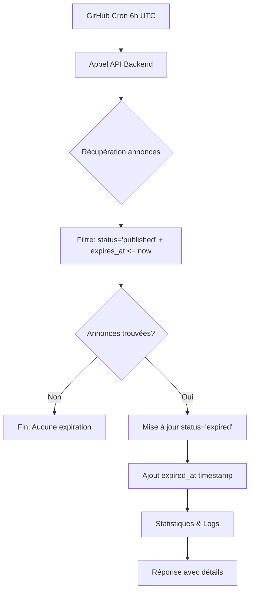

# 🕐 Système d'Expiration Automatique des Annonces DodoPartage

## 📋 Vue d'Ensemble

Le système d'expiration automatique DodoPartage gère le cycle de vie des annonces en les faisant expirer automatiquement selon des règles métier définies. Il évite l'accumulation d'annonces obsolètes et maintient la fraîcheur du contenu.

## 🎯 Objectifs

- **Automatisation complète** : Aucune intervention manuelle requise
- **Règles métier précises** : Différentes logiques selon le type d'annonce
- **Respect des actions utilisateur** : Priorité aux suppressions manuelles
- **Fiabilité** : Système résilient avec monitoring intégré

## ⚙️ Architecture du Système

### **1. Composants Principaux**

```
┌─────────────────┐    ┌──────────────────┐    ┌─────────────────┐
│   GitHub Cron   │ ───▶│  Backend API     │ ───▶│   Airtable      │
│   (Daily 6h)    │    │  Railway Server  │    │   Database      │
└─────────────────┘    └──────────────────┘    └─────────────────┘
                              │
                              ▼
                       ┌──────────────────┐
                       │   Monitoring     │
                       │   & Alerting     │
                       └──────────────────┘
```

### **2. Technologies Utilisées**

- **GitHub Actions** : Déclenchement automatique quotidien
- **Railway Backend** : API Node.js d'expiration
- **Airtable** : Base de données des annonces
- **Scripts Node.js** : Monitoring et diagnostic

## 📊 Logique d'Expiration

### **1. Types d'Annonces et Règles**

| Type | Champ de Référence | Logique d'Expiration | Exemple |
|------|-------------------|----------------------|---------|
| **OFFERS** | `shipping_date` | Lendemain de la date d'expédition | Expédition 15/08 → Expiration 16/08 |
| **SEARCHES** | `shipping_period_end` | Lendemain du 1er jour du mois suivant | Période Jan-Mar 2025 → Expiration 2 Avril 2025 |

### **2. Calcul Détaillé**

#### **OFFERS (Offres de Place)**
```javascript
// Si shipping_date = "2025-08-15"
const shippingDate = new Date("2025-08-15");
const expirationDate = new Date(shippingDate);
expirationDate.setDate(expirationDate.getDate() + 1);
// expires_at = "2025-08-16T00:00:00.000Z"
```

#### **SEARCHES (Demandes de Place)**
```javascript
// Si shipping_period_end = "2025-03-31" (période Jan-Mars)
const endDate = new Date("2025-03-31");
const nextMonth = new Date(endDate.getFullYear(), endDate.getMonth() + 1, 1); // 1er avril
const expirationDate = new Date(nextMonth);
expirationDate.setDate(expirationDate.getDate() + 1); // 2 avril
// expires_at = "2025-04-02T00:00:00.000Z"
```

### **3. Gestion des Cas Particuliers**

- **Annonces sans date** : Ignorées (pas d'expiration)
- **Anciennes demandes** : Fallback 60 jours après création
- **Annonces supprimées** : Exclues définitivement (priorité utilisateur)

## 🔄 Workflow d'Expiration

### **1. Déclenchement Automatique**

```yaml
# .github/workflows/expire-announcements.yml
schedule:
  - cron: '0 6 * * *'  # Tous les jours à 6h UTC (8h France)
```

### **2. Processus d'Expiration**



### **3. Filtre de Sélection**

```javascript
// Seules les annonces ÉLIGIBLES sont traitées
filterByFormula: `AND(
  {status} = 'published',           // Seulement les annonces actives
  {expires_at} != '',               // Avec date d'expiration définie  
  {expires_at} <= '${now}'          // Date dépassée
)`
```

## 📁 Structure des Données

### **1. Champs Airtable Utilisés**

| Champ | Type | Description | Exemple |
|-------|------|-------------|---------|
| `expires_at` | DateTime | Date programmée d'expiration | `2025-08-16T00:00:00.000Z` |
| `expired_at` | DateTime | Timestamp effectif d'expiration | `2025-08-16T06:15:30.234Z` |
| `status` | Select | État de l'annonce | `published`, `expired`, `deleted` |
| `shipping_date` | Date | Date d'expédition (OFFERS) | `2025-08-15` |
| `shipping_period_end` | Date | Fin période (SEARCHES) | `2025-03-31` |

### **2. États Possibles**

```
pending_validation → published → expired (automatique)
                           ↓
                      deleted (utilisateur)
```

## 🛠️ Outils de Gestion

### **1. Scripts de Monitoring**

| Script | Usage | Description |
|--------|-------|-------------|
| `debug-expiration.js` | Diagnostic quotidien | État global du système |
| `monitor-expiration-conflicts.js` | Vérification cohérence | Détection d'anomalies |
| `migrate-expires-at.js` | Migration initiale | Calcul dates manquantes |

### **2. Commandes Utiles**

```bash
# Diagnostic système
node scripts/debug-expiration.js

# Expiration manuelle
curl -X POST https://web-production-7b738.up.railway.app/api/cron/expire-announcements

# Monitoring des conflits
node scripts/monitor-expiration-conflicts.js

# Test endpoint
curl "https://web-production-7b738.up.railway.app/api/partage/get-announcements?status=published&limit=5"
```

## 📊 Monitoring et Alertes

### **1. Métriques Surveillées**

- **Nombre d'annonces expirées** par jour
- **Erreurs de traitement**
- **Temps d'exécution** du processus
- **Annonces en retard** d'expiration

### **2. Logs Détaillés**

```javascript
// Exemple de log d'expiration
{
  "success": true,
  "message": "Expiration terminée: 3 annonce(s) expirée(s)",
  "processed": 3,
  "expired": 3,
  "errors": 0,
  "remaining_published": 15,
  "duration": "2340ms",
  "details": [
    {"name": "Pierre", "route": "France → Réunion"},
    {"name": "Marie", "route": "Martinique → France"}
  ]
}
```

### **3. Détection d'Anomalies**

Le script `monitor-expiration-conflicts.js` détecte :
- ❌ Annonces `deleted` avec `expires_at` futur
- ❌ Annonces `expired` sans `expired_at`  
- ❌ Annonces `published` expirées depuis >1 jour

## 🚨 Gestion des Erreurs

### **1. Cas d'Erreur Courants**

| Erreur | Cause | Solution |
|--------|-------|----------|
| API Airtable timeout | Surcharge temporaire | Retry automatique |
| Annonce non trouvée | Suppression concurrente | Log et continue |
| Format date invalide | Données corrompues | Ignore l'annonce |

### **2. Plan de Continuité**

```javascript
// Gestion résiliente des erreurs
const updatePromises = expiredRecords.map(async (record) => {
  try {
    await base(partageTableName).update(record.id, {
      status: 'expired',
      expired_at: new Date().toISOString()
    });
    return { id: record.id, success: true };
  } catch (error) {
    console.error(`Erreur ${record.id}:`, error.message);
    return { id: record.id, success: false, error: error.message };
  }
});
```

## 🔧 Configuration

### **1. Variables d'Environnement**

```env
AIRTABLE_API_KEY=key***          # Clé API Airtable
AIRTABLE_BASE_ID=app***          # ID de la base
AIRTABLE_PARTAGE_TABLE_NAME=DodoPartage - Announcement
```

### **2. Paramètres Système**

```javascript
// Fréquence d'exécution
const CRON_SCHEDULE = '0 6 * * *';  // 6h UTC quotidien

// Timeout de sécurité  
const MAX_EXECUTION_TIME = 300000;  // 5 minutes

// Limite de traitement
const MAX_RECORDS_PER_RUN = 100;    // 100 annonces max
```

## 📈 Performances

### **1. Métriques Typiques**

- **Temps d'exécution** : 2-10 secondes
- **Annonces traitées** : 0-20 par jour
- **Taux de succès** : >99%
- **Charge serveur** : Minimale

### **2. Optimisations**

- **Filtre Airtable** : Préfiltrage côté base
- **Traitement parallèle** : Mises à jour simultanées
- **Logs structurés** : Debugging facilité

## 🔄 Évolutions Futures

### **1. Améliorations Possibles**

- **Notifications utilisateur** : Email avant expiration
- **Extension de délai** : Option de prolongation
- **Expiration différée** : Week-ends exclus
- **Statistiques avancées** : Dashboard temps réel

### **2. Considérations Techniques**

- **Scalabilité** : Pagination pour gros volumes
- **Redondance** : Backup des configurations
- **Audit** : Traçabilité complète des actions

## ✅ Checklist de Validation

### **Système Opérationnel**
- [ ] Cron GitHub Actions activé
- [ ] API Backend accessible
- [ ] Colonne `expires_at` présente dans Airtable
- [ ] Scripts de monitoring fonctionnels
- [ ] Logs d'expiration visibles

### **Tests de Cohérence**
- [ ] Annonces `deleted` non affectées
- [ ] Calculs de dates corrects  
- [ ] Gestion d'erreurs robuste
- [ ] Monitoring sans anomalies

## 📞 Support et Maintenance

### **Contacts**
- **Développeur** : Équipe technique DodoPartage
- **Documentation** : `docs/expiration-system.md`
- **Scripts** : `scripts/debug-*.js`

### **Ressources**
- **API Backend** : https://web-production-7b738.up.railway.app
- **GitHub Actions** : Repository dodomove-backend
- **Base Airtable** : DodoPartage - Announcement

---

🎉 **Le système d'expiration automatique DodoPartage est opérationnel et maintient automatiquement la fraîcheur des annonces !** 